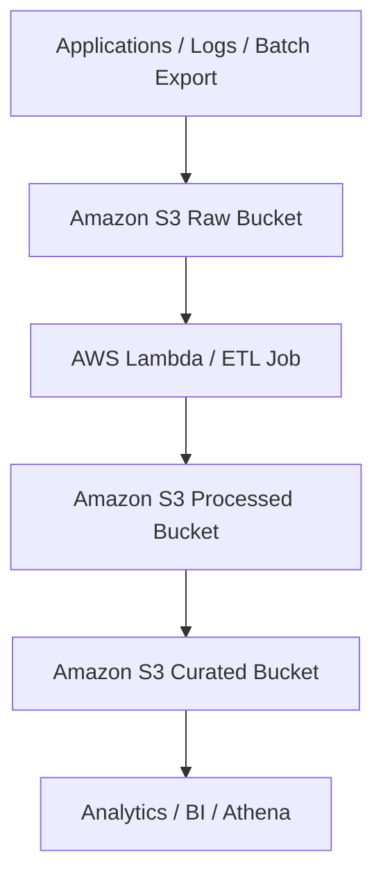

# 3장. Storage

스토리지 문제는 내구성, 성능, 공유 방식, 보관 기간, 비용이 함께 출제된다. `Amazon S3`와 블록 스토리지, 파일 스토리지, 아카이브 스토리지를 각각 어떤 문제에 적용하는지 구분해야 한다.

## Amazon S3

### 1. 서비스 개념

`Amazon S3`는 객체 스토리지 서비스다. 사실상 무제한 확장성과 11 9s 내구성을 기반으로 백업, 정적 웹 호스팅, 데이터 레이크, 로그 저장소에 널리 사용된다.

### 2. 아키텍처 구조

```text
Client / App
   |
   v
Amazon S3 Bucket
   |
   +--> Objects
   +--> Versioning
   +--> Encryption
   +--> Lifecycle / Replication
```

시험에서 `Amazon S3`는 단순 객체 저장소를 넘어 데이터 레이크의 중심 저장소로 자주 연결된다.



### 3. 언제 사용하는가

- 이미지, 로그, 백업, 정적 파일 저장
- 데이터 레이크 원본 저장소
- 다수 클라이언트가 동시에 접근하는 객체 기반 저장소

### 4. 언제 사용하면 안되는가

- POSIX 파일 시스템이 필요한 경우
- 인스턴스에 블록 디바이스로 직접 마운트해야 하는 경우

### 5. 비슷한 서비스와 차이

- `EBS`는 단일 인스턴스용 블록 스토리지다.
- `EFS`는 여러 인스턴스가 공유하는 파일 스토리지다.
- `S3`는 객체 스토리지라 수정 대신 새 객체 업로드 중심이다.

### 6. 시험에서 자주 나오는 문제 유형

- 정적 웹 호스팅
- 백업/로그 저장소
- 퍼블릭 액세스 차단과 버킷 정책
- 수명 주기 정책과 계층 전환

### 7. 시험 함정 포인트

- `S3`는 파일 시스템이 아니다.
- 객체 단위 저장이며 부분 업데이트 개념이 블록 스토리지와 다르다.
- 강한 일관성, 버전 관리, 암호화, 퍼블릭 액세스 차단을 문제 요구사항과 연결해야 한다.

### 8. 실무 아키텍처 예시

애플리케이션 로그는 `Amazon S3`로 수집하고, 최근 30일은 표준 클래스, 이후는 저비용 클래스로 전환한다. 정적 자산은 `CloudFront`와 함께 캐시해 전 세계 사용자에게 빠르게 전달한다.

데이터 플랫폼 관점에서는 원천 로그와 가공 데이터를 서로 다른 버킷 또는 prefix로 분리해 데이터 레이크를 구성한다. 시험에서는 "원본 보존", "저비용 확장", "분석용 저장소"라는 표현이 나오면 `Amazon S3` 중심 구조를 먼저 떠올리면 된다.

### 시험 핵심 포인트

- 정적 웹사이트, 로그, 백업, 데이터 레이크 문제는 `Amazon S3`가 자주 정답이다.
- 객체 스토리지이므로 블록 디스크나 POSIX 파일 시스템 요구와 구분해야 한다.
- `CloudFront`, `Lifecycle`, `Replication`, 암호화와 자주 묶여 출제된다.

## S3 Storage Classes

### 1. 서비스 개념

`S3 Storage Classes`는 접근 패턴과 복구 시간에 따라 비용 구조를 달리하는 객체 저장 등급이다.

### 2. 아키텍처 구조

```text
S3 Object
  |
  +--> Standard
  +--> Standard-IA
  +--> One Zone-IA
  +--> Intelligent-Tiering
  +--> Glacier Instant Retrieval
  +--> Glacier Flexible Retrieval
  +--> Glacier Deep Archive
```

### 3. 언제 사용하는가

- 자주 접근하면 `Standard`
- 드물게 접근하지만 즉시 복구가 필요하면 `Standard-IA`
- 접근 패턴을 모르면 `Intelligent-Tiering`
- 장기 보관이면 `Glacier` 계열

### 4. 언제 사용하면 안되는가

- 최소 보관 기간, 검색 비용을 고려하지 않고 무조건 저렴한 클래스로 옮기려는 경우
- 단일 AZ 손실이 허용되지 않는데 `One Zone-IA`를 고르는 경우

### 5. 비슷한 서비스와 차이

- `Standard-IA`는 다중 AZ, `One Zone-IA`는 단일 AZ다.
- `Intelligent-Tiering`은 모니터링 비용이 있지만 패턴 예측이 어려울 때 유리하다.
- `Glacier` 계열은 검색 지연을 허용하는 대신 매우 저렴하다.

### 6. 시험에서 자주 나오는 문제 유형

- 오래된 로그의 저비용 보관
- 예측 어려운 접근 패턴에 자동 최적화
- 복구 시간 요구사항에 따른 Glacier 계열 선택

### 7. 시험 함정 포인트

- 가장 싼 클래스가 항상 정답은 아니다. 검색 시간과 최소 보관 기간을 함께 봐야 한다.
- `One Zone-IA`는 고가용성 요구사항과 충돌할 수 있다.

### 8. 실무 아키텍처 예시

분석 로그는 초기 30일간 `Standard`, 이후 90일은 `Standard-IA`, 장기 보관은 `Glacier Deep Archive`로 이동한다. 접근 패턴이 불확실한 사용자 업로드 데이터는 `Intelligent-Tiering`으로 시작하는 전략도 실무적이다.

### 시험 핵심 포인트

- 접근 빈도와 복구 시간 요구가 핵심 판단 기준이다.
- 장기 보관이면 `Glacier` 계열, 예측 불가 패턴이면 `Intelligent-Tiering`을 먼저 본다.
- `One Zone-IA`는 고가용성 요구와 충돌할 수 있다.

## S3 Lifecycle

### 1. 서비스 개념

`S3 Lifecycle`은 객체를 자동 전환 또는 삭제하는 정책 기능이다. 비용 최적화 문제에서 매우 자주 출제된다.

### 2. 아키텍처 구조

```text
S3 Bucket
   |
   v
Lifecycle Rules
   |
   +--> Transition to cheaper class
   +--> Expire old objects
   +--> Manage noncurrent versions
```

### 3. 언제 사용하는가

- 로그, 백업, 아카이브 데이터를 주기적으로 저비용 계층으로 전환할 때
- 오래된 버전과 만료 데이터를 자동 삭제할 때

### 4. 언제 사용하면 안되는가

- 자주 접근하는 데이터를 너무 이르게 아카이브해 검색 비용과 지연을 키우는 경우
- 규제상 보존해야 하는 데이터를 검토 없이 삭제 정책에 넣는 경우

### 5. 비슷한 서비스와 차이

- `S3 Lifecycle`은 객체 생명주기 자동화다.
- `S3 Replication`은 복제 목적이며 비용 최적화 수단이 아니다.

### 6. 시험에서 자주 나오는 문제 유형

- 30일 후 IA, 1년 후 Glacier 이동
- 만료된 멀티파트 업로드 자동 삭제
- 버전 관리 버킷의 이전 버전 정리

### 7. 시험 함정 포인트

- 클래스 전환과 삭제는 별도 정책으로 이해해야 한다.
- 복제된 객체에도 별도 라이프사이클 정책이 필요할 수 있다.

### 8. 실무 아키텍처 예시

보안 로그 버킷은 최신 90일은 즉시 조회 가능해야 하므로 `Standard-IA`까지만 내리고, 1년 이후는 `Glacier Flexible Retrieval`, 7년 이후 삭제로 운영해 감사와 비용 요구를 함께 맞춘다.

### 시험 핵심 포인트

- 장기 로그와 백업 비용 절감 문제는 `S3 Lifecycle`이 기본 정답 축이다.
- 전환 시점, 삭제 시점, 이전 버전 관리가 함께 나올 수 있다.
- 검색 지연과 최소 보관 기간을 무시하면 오답을 고르기 쉽다.

## S3 Replication

### 1. 서비스 개념

`S3 Replication`은 객체를 다른 버킷으로 자동 복제하는 기능이다. 동일 리전의 `SRR`, 다른 리전의 `CRR`이 있다.

### 2. 아키텍처 구조

```text
Source Bucket
    |
    v
Replication Rule
    |
    +--> Destination Bucket (same Region)
    +--> Destination Bucket (another Region)
```

### 3. 언제 사용하는가

- 재해 복구를 위해 다른 리전에 데이터 사본이 필요할 때
- 계정 간 로그 중앙화가 필요할 때
- 규제에 따라 지역별 데이터 복제가 필요할 때

### 4. 언제 사용하면 안되는가

- 기존 모든 객체가 자동으로 즉시 복제된다고 오해하는 경우
- 삭제 마커나 버전 정책을 이해하지 않은 상태에서 무조건 복제를 거는 경우

### 5. 비슷한 서비스와 차이

- `CRR`은 리전 간 복제, `SRR`은 동일 리전 복제다.
- 백업과 유사해 보이지만 목적은 지속적 복제이며, 버전 관리가 전제다.

### 6. 시험에서 자주 나오는 문제 유형

- DR 리전으로 객체 자동 복제
- 다른 계정의 보안 로그 버킷으로 중앙화
- 복제를 위한 버전 관리 요구사항

### 7. 시험 함정 포인트

- 버전 관리가 활성화되어야 한다.
- 기존 객체는 기본적으로 자동 복제되지 않는다.
- 암호화된 객체 복제 시 키 권한까지 확인해야 한다.

### 8. 실무 아키텍처 예시

프로덕션 리전의 사용자 업로드 버킷은 `CRR`로 DR 리전에 복제한다. 원본 리전 장애 시 애플리케이션은 DR 버킷을 참조하고, 메타데이터는 별도 데이터베이스 복제 구조와 함께 운영한다.

### 시험 핵심 포인트

- 다른 리전 DR 또는 계정 간 복제 요구가 있으면 `S3 Replication`을 검토한다.
- 버전 관리가 선행 조건이라는 점이 반복 함정이다.
- 기존 객체 자동 복제 여부를 문제 문장에서 꼭 확인해야 한다.

## Amazon EBS

### 1. 서비스 개념

`Amazon EBS`는 `EC2`에 연결하는 블록 스토리지다. 운영체제 디스크, 데이터 디스크, 고성능 영구 저장소에 사용한다.

### 2. 아키텍처 구조

```text
EC2 Instance
   |
   v
EBS Volume
   |
   +--> gp3 / io2 / st1 / sc1
   +--> Snapshot to S3-managed backend
```

### 3. 언제 사용하는가

- 단일 인스턴스에 영구 블록 스토리지가 필요할 때
- 데이터베이스, 파일 시스템, 애플리케이션 디스크용 저장소가 필요할 때

### 4. 언제 사용하면 안되는가

- 여러 인스턴스가 동시에 공유 파일 시스템으로 써야 할 때
- 객체 저장이 더 적합한 대용량 정적 파일 보관일 때

### 5. 비슷한 서비스와 차이

- `EBS`는 블록, `EFS`는 공유 파일, `S3`는 객체다.
- `Instance Store`는 더 휘발성이 강하며 인스턴스 중지/종료에 취약하다.

### 6. 시험에서 자주 나오는 문제 유형

- 루트 볼륨 스냅샷 백업
- IOPS 요구사항에 따른 `gp3`와 `io2` 선택
- AZ 종속성과 볼륨 이동 문제

### 7. 시험 함정 포인트

- `EBS` 볼륨은 AZ 단위 리소스다.
- 스냅샷은 증분이며 리전 간 복사가 가능하다.
- 인스턴스를 멈춰도 EBS 데이터는 유지되지만 `Instance Store`는 그렇지 않다.

### 8. 실무 아키텍처 예시

상태 저장 애플리케이션 서버는 루트 볼륨과 별도 데이터 볼륨을 `gp3`로 구성하고, 일별 스냅샷 정책으로 복구 지점을 확보한다.

### 시험 핵심 포인트

- 단일 서버용 영구 블록 디스크는 `Amazon EBS`다.
- AZ 종속 리소스라서 볼륨 이동과 장애 복구 문제에서 자주 나온다.
- `Amazon S3`나 `Amazon EFS`와 저장 방식이 다르다는 점을 명확히 구분해야 한다.

## Amazon EFS

### 1. 서비스 개념

`Amazon EFS`는 여러 `EC2` 인스턴스가 동시에 마운트할 수 있는 관리형 NFS 파일 시스템이다.

### 2. 아키텍처 구조

```text
EC2 in AZ-a ----\
EC2 in AZ-b -----+--> Amazon EFS
EC2 in AZ-c ----/
```

### 3. 언제 사용하는가

- 다수의 리눅스 인스턴스가 공유 파일 시스템을 사용해야 할 때
- 콘텐츠 저장소, 웹 서버 공유 파일, 분석 워크플로에 적합하다

### 4. 언제 사용하면 안되는가

- 블록 디스크 성능이 필요한 데이터베이스
- 윈도우 파일 서버 기능이 필요한 경우

### 5. 비슷한 서비스와 차이

- `EBS`는 단일 인스턴스용 블록
- `EFS`는 다중 인스턴스 공유 파일
- `FSx`는 특정 파일 시스템 특화 옵션 제공

### 6. 시험에서 자주 나오는 문제 유형

- 여러 웹 서버가 동일 업로드 디렉터리를 공유해야 하는 문제
- 멀티 AZ에서 자동 확장 파일 시스템이 필요한 문제

### 7. 시험 함정 포인트

- 리눅스 NFS 기반이라는 점을 기억해야 한다.
- `EFS IA`와 라이프사이클 정책도 비용 문제에서 자주 묻는다.

### 8. 실무 아키텍처 예시

CMS 웹 서버 여러 대가 `EFS`를 공유 마운트해 이미지와 템플릿 파일을 함께 사용한다. `ALB` 뒤에서 인스턴스가 교체돼도 파일은 유지된다.

### 시험 핵심 포인트

- 여러 리눅스 인스턴스가 공유 파일 시스템을 써야 하면 `Amazon EFS`를 본다.
- 자동 확장 파일 스토리지와 Multi-AZ 공유가 핵심 키워드다.
- 데이터베이스 디스크처럼 블록 성능이 필요한 경우와는 구분해야 한다.

## Amazon FSx

### 1. 서비스 개념

`Amazon FSx`는 특정 파일 시스템을 관리형으로 제공하는 서비스군이다. `FSx for Windows File Server`, `FSx for Lustre`, `FSx for NetApp ONTAP`, `FSx for OpenZFS`가 있다.

### 2. 아키텍처 구조

```text
Application
   |
   +--> FSx for Windows File Server
   +--> FSx for Lustre
   +--> FSx for NetApp ONTAP
   +--> FSx for OpenZFS
```

### 3. 언제 사용하는가

- Windows SMB 공유가 필요할 때
- 고성능 병렬 파일 시스템이 필요한 HPC 워크로드일 때
- 온프레미스 NAS 기능과 유사한 기능을 원할 때

### 4. 언제 사용하면 안되는가

- 단순 공유 파일이면 `EFS`로 충분한 경우
- 객체 저장이 더 적합한 대규모 정적 데이터일 때

### 5. 비슷한 서비스와 차이

- `EFS`는 범용 NFS
- `FSx for Windows File Server`는 SMB/AD 통합
- `FSx for Lustre`는 고성능 컴퓨팅에 특화

### 6. 시험에서 자주 나오는 문제 유형

- Windows 파일 공유를 AWS로 이전하는 문제
- 고성능 파일 시스템이 필요한 분석 또는 ML 워크로드

### 7. 시험 함정 포인트

- 요구하는 프로토콜이 NFS인지 SMB인지 먼저 확인해야 한다.
- HPC 문제에서 `FSx for Lustre`가 자주 정답 후보가 된다.

### 8. 실무 아키텍처 예시

기업 파일 서버를 AWS로 옮길 때 Active Directory 통합이 필요하면 `FSx for Windows File Server`를 사용한다. 고속 분석 워크로드는 `S3`와 연결된 `FSx for Lustre`를 쓸 수 있다.

### 시험 핵심 포인트

- Windows SMB, Lustre, ONTAP 같은 특화 파일 시스템 요구가 있으면 `Amazon FSx`가 정답 후보다.
- 문제 문장에 SMB, Active Directory, HPC가 보이면 우선순위가 올라간다.
- `Amazon EFS`보다 파일 시스템 특화 기능이 강점이다.

## Glacier

### 1. 서비스 개념

`Glacier`는 `S3 Glacier` 계열의 장기 보관 스토리지 클래스들을 가리키는 표현으로 자주 쓰인다. 핵심은 매우 낮은 비용 대신 검색 시간이 길 수 있다는 점이다.

### 2. 아키텍처 구조

```text
S3 Bucket
   |
   v
Lifecycle Transition
   |
   +--> Glacier Instant Retrieval
   +--> Glacier Flexible Retrieval
   +--> Glacier Deep Archive
```

### 3. 언제 사용하는가

- 규제 보관, 장기 백업, 감사 로그 장기 저장
- 거의 읽지 않지만 삭제하면 안 되는 데이터

### 4. 언제 사용하면 안되는가

- 사용자가 즉시 자주 다운로드해야 하는 데이터
- 복구 시간이 길면 안 되는 운영 데이터

### 5. 비슷한 서비스와 차이

- `Glacier Instant Retrieval`은 빠른 조회
- `Flexible Retrieval`은 아카이브형
- `Deep Archive`는 가장 저렴하지만 복구가 가장 느리다

### 6. 시험에서 자주 나오는 문제 유형

- 7년 이상 보관해야 하는 규제 데이터
- 비용을 최우선으로 하는 장기 백업

### 7. 시험 함정 포인트

- 아카이브 복구 시간과 검색 비용을 함께 읽어야 한다.
- 운영 데이터와 백업 데이터를 같은 등급에 두면 오답이 되기 쉽다.

### 8. 실무 아키텍처 예시

의료 감사 로그는 1년간 즉시 조회가 가능해야 하므로 초기에는 `Standard-IA`, 이후 6년은 `Glacier Deep Archive`로 전환해 보관 비용을 최소화한다.

### 시험 핵심 포인트

- 규제 보관과 장기 아카이브는 `Glacier` 계열을 먼저 본다.
- 가장 싼 옵션이 정답이 아니라 복구 시간 요구를 함께 맞춰야 한다.
- 운영 데이터와 장기 백업 데이터를 같은 스토리지 클래스로 보면 오답 가능성이 높다.

## 장 마무리

- 객체, 블록, 파일 스토리지 차이를 먼저 구분하면 대부분의 선택지가 정리된다.
- 비용 문제는 `S3 Storage Classes`와 `S3 Lifecycle`을 먼저 떠올리면 빠르다.
- 공유 파일 시스템은 `EFS`, Windows SMB는 `FSx`, 단일 서버 디스크는 `EBS`라는 축을 기억하면 된다.
