# 9장. Architecture Patterns

이 장은 개별 서비스 암기를 아키텍처 의사결정으로 연결하는 장이다. 시험 문제는 대부분 서비스 이름보다 요구사항 조합으로 출제되므로, 패턴 단위로 정리해야 점수가 올라간다. 주요 Mermaid 원본은 `diagrams/` 디렉터리에도 함께 보관한다.

  <h2>이 장에서 바로 이동할 수 있는 패턴</h2>
  
고가용성, 서버리스, 이벤트 기반, 글로벌 전송, 데이터 레이크, DR 패턴을 빠르게 비교해 문제에 대응할 수 있다.

  

    <a href="#pattern-ha-web">고가용성 웹</a>
    <a href="#pattern-serverless">서버리스</a>
    <a href="#pattern-event-driven">이벤트 기반</a>
    <a href="#pattern-microservices">마이크로서비스</a>
    <a href="#pattern-read-scale">읽기 확장</a>
    <a href="#pattern-global-content">글로벌 전송</a>
    <a href="#pattern-data-lake">데이터 레이크</a>
    <a href="#pattern-dr">DR</a>
    <a href="#pattern-security-network">보안 우선 네트워크</a>
    <a href="#pattern-cost">비용 최적화</a>
    <a href="#pattern-decision-guide">의사결정 가이드</a>
  

## 1. 고가용성 웹 아키텍처 패턴

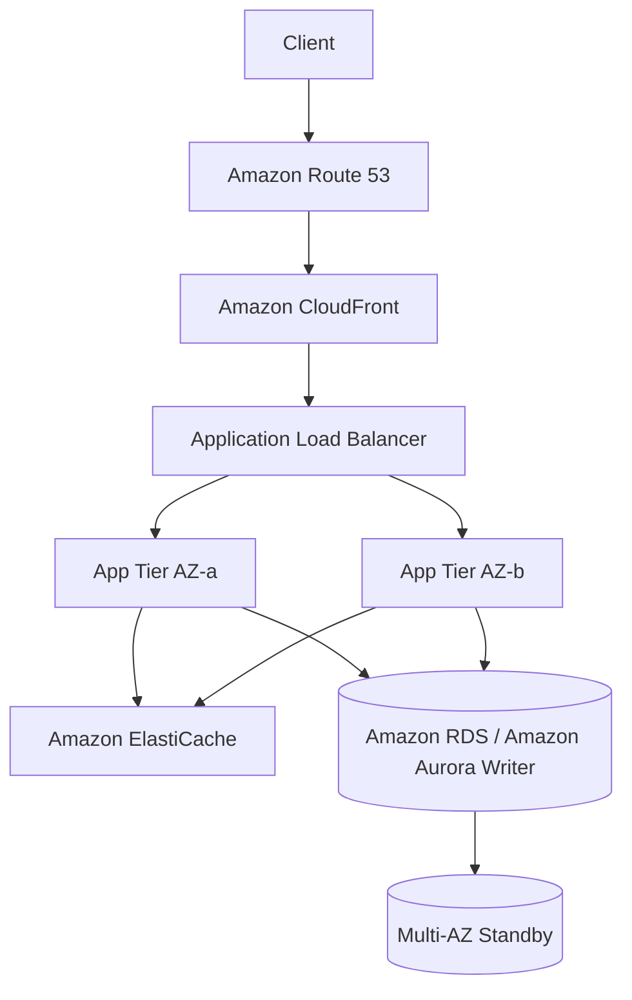

- 프런트 계층은 `Amazon CloudFront`로 캐시와 TLS 종료를 담당한다.
- 애플리케이션 계층은 `Amazon EC2`, `Amazon ECS`, `AWS Fargate` 중 하나로 무상태 구성 후 오토스케일링한다.
- 데이터 계층은 `Amazon RDS Multi-AZ` 또는 `Amazon Aurora`로 보호하고, 읽기 성능이 필요하면 `Read Replica` 또는 Reader endpoint를 추가한다.
- 시험 포인트: "고가용성"과 "운영 표준화"가 동시에 보이면 `ALB + Multi-AZ + Auto Scaling + 관리형 DB` 조합을 먼저 떠올린다.

## 2. 서버리스 아키텍처 패턴

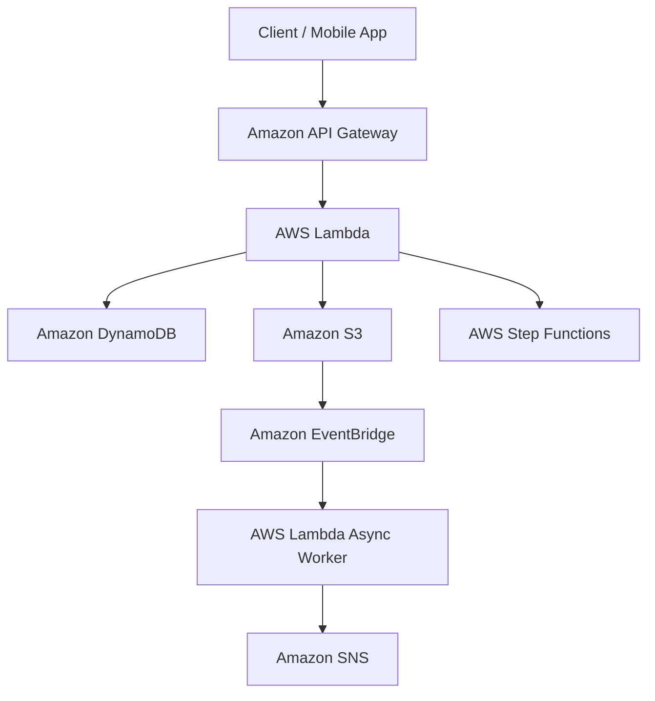

- 요청량 예측이 어렵고 운영 부담을 최소화해야 할 때 적합하다.
- API 처리와 후속 비동기 작업을 분리하면 서버리스 구조에서도 안정성을 높일 수 있다.
- 시험 포인트: "서버 관리 없음", "간헐적 트래픽", "사용량 기반 과금"이 핵심 문구다.

## 3. 이벤트 기반 아키텍처 패턴

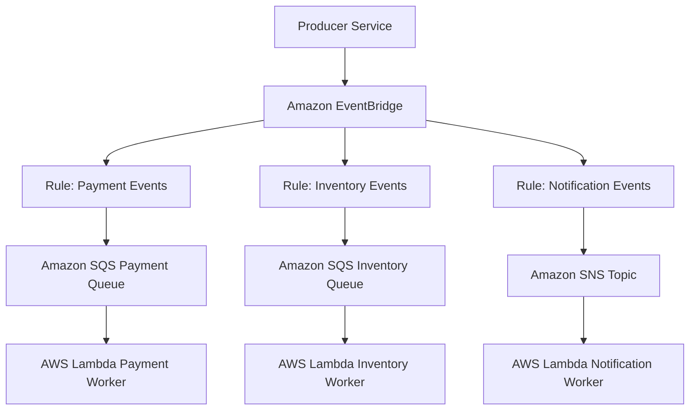

- 생산자와 소비자를 분리해 서비스 간 결합도를 낮춘다.
- 각 소비자는 자기 처리 속도에 맞춰 이벤트를 받으므로 장애 전파를 줄이기 쉽다.
- 시험 포인트: 규칙 기반 라우팅은 `Amazon EventBridge`, 버퍼링과 재처리는 `Amazon SQS`, 다중 구독 팬아웃은 `Amazon SNS`다.

## 4. 마이크로서비스 아키텍처 패턴

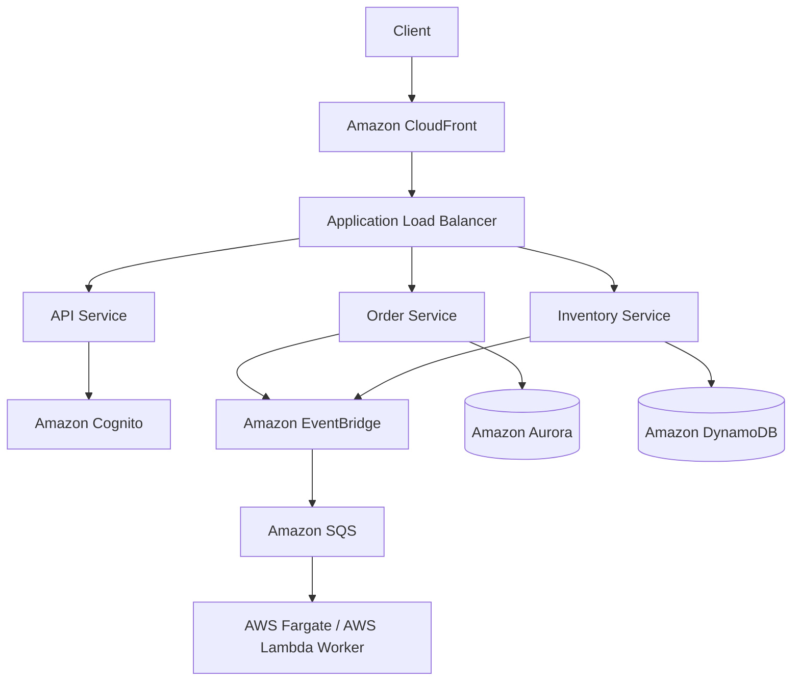

- 경계가 분리된 서비스별 저장소를 선택해 독립 배포와 독립 확장을 가능하게 한다.
- 동기 호출은 최소화하고, 도메인 이벤트는 비동기 경로로 넘겨 병목을 줄인다.
- 시험 포인트: 서비스별 데이터 분리, 비동기 이벤트 전달, API 진입점 통합이 마이크로서비스 문제의 핵심 단서다.

## 5. 읽기 중심 확장 패턴

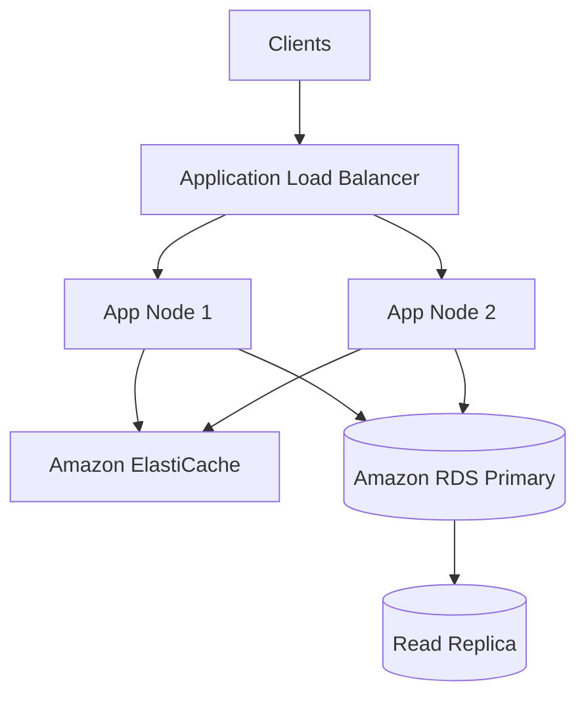

- 읽기 부하가 많으면 먼저 캐시 적중률을 높이고, 이후에도 부족하면 읽기 복제본을 추가한다.
- 쓰기 일관성이 중요한 트랜잭션은 Primary로 유지하고 조회성 트래픽만 분리한다.
- 시험 포인트: `Read Replica`는 읽기 확장, `Multi-AZ`는 고가용성이라는 목적 차이를 반드시 구분해야 한다.

## 6. 글로벌 콘텐츠 배포 패턴

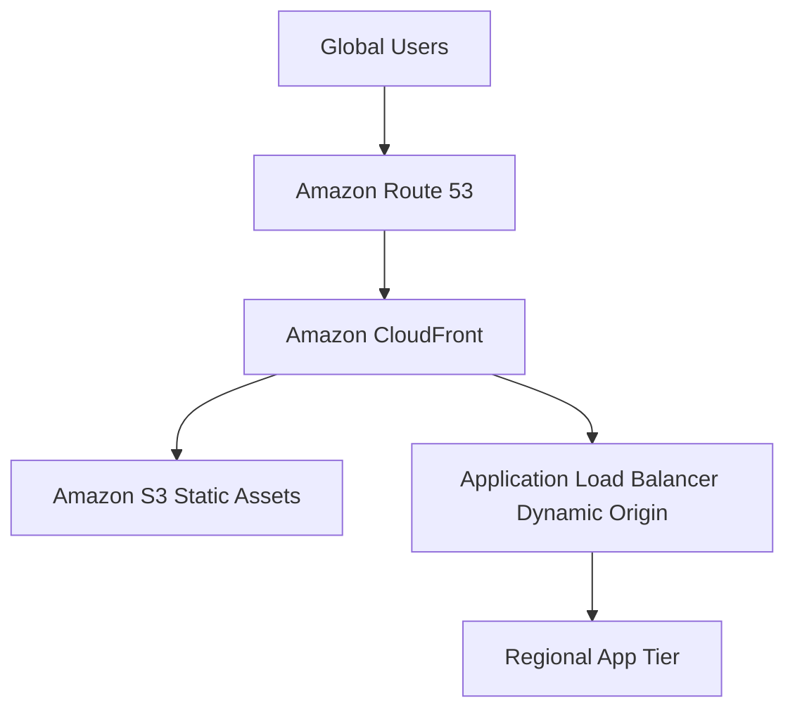

- 정적 콘텐츠는 엣지 캐시로 가속하고 오리진 부하를 줄인다.
- 동적 콘텐츠도 전송 경로 최적화와 TLS 종료에 이점이 있다.
- 시험 포인트: 캐시가 핵심이면 `CloudFront`, 네트워크 경로 최적화와 고정 IP가 핵심이면 `Global Accelerator`다.

## 7. 데이터 레이크 아키텍처 패턴

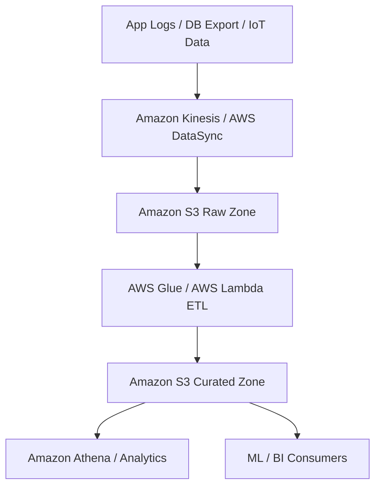

- 데이터 레이크 문제의 핵심은 `Amazon S3`를 중심으로 원천 데이터와 가공 데이터를 논리적으로 분리하는 것이다.
- 적재, 가공, 분석 계층을 나누면 비용과 보안 정책을 데이터 단계별로 적용하기 쉽다.
- 시험 포인트: "대용량 원본 저장", "유연한 확장", "저비용 장기 보관"이 보이면 `Amazon S3` 기반 데이터 레이크를 우선 검토한다.

## 8. DR 패턴

### Backup and Restore

- 가장 저렴하지만 복구 시간이 길다.
- 백업 데이터만 다른 리전에 보관한다.

### Pilot Light

- 핵심 데이터베이스와 최소 핵심 서비스만 대기한다.
- 장애 시 애플리케이션 계층을 빠르게 확장한다.

### Warm Standby

- 축소된 전체 환경을 항상 유지한다.
- 복구 시간이 더 짧다.

### Multi-Site Active/Active

- 가장 비싸지만 복구 시간과 복구 시점이 가장 유리하다.
- `Route 53`, `Global Accelerator`, `DynamoDB Global Tables`, `Aurora Global Database`가 함께 나올 수 있다.

## 9. 보안 우선 네트워크 패턴

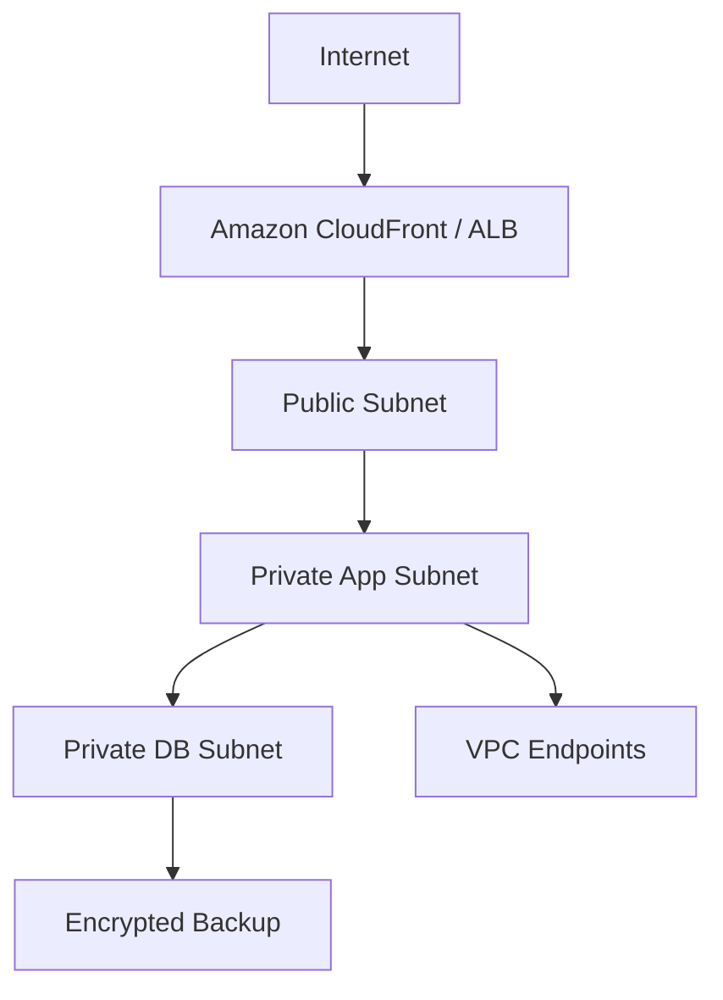

- 외부 공개는 최소 진입점에만 허용한다.
- 내부 서비스는 `Security Group` 참조와 `VPC Endpoints`로 보호한다.
- 시험 포인트: 데이터베이스는 프라이빗, 관리자 접근은 제한된 경로, 로그는 중앙 저장소로 보낸다.

## 10. 비용 최적화 패턴

- 상시 부하는 `Savings Plans` 또는 `Reserved Instances`
- 변동 부하는 `Spot Instances`
- 간헐적 API는 `Lambda`
- 장기 로그는 `S3 Lifecycle`
- 자주 읽는 데이터는 `ElastiCache`로 DB 비용 감소

## 11. 시험에서 패턴으로 읽는 방법

- "운영 부담 최소화"라는 문구가 있으면 서버리스나 관리형 서비스로 기운다.
- "고가용성"이 있으면 Multi-AZ, 분산 라우팅, 중복 컴포넌트를 먼저 찾는다.
- "비용 절감"이 있으면 약정 할인, 스팟, 수명 주기 정책을 함께 본다.
- "보안 강화"가 있으면 최소 권한, 암호화, 프라이빗 경로, 감사 로그를 조합한다.

## 12. 아키텍처 의사결정 가이드

아래 가이드는 시험 문제를 읽을 때 서비스를 고르는 순서를 빠르게 정리하기 위한 것이다. 정답은 기능만이 아니라 운영 모델과 비용 제약까지 함께 만족해야 한다.

### Compute 의사결정

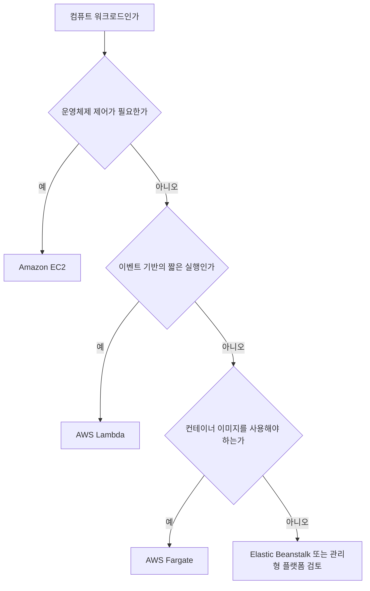

- 서버 제어권이 필요하면 `Amazon EC2`
- 서버리스 이벤트 처리면 `AWS Lambda`
- 컨테이너는 유지하되 서버 관리는 줄이고 싶으면 `AWS Fargate`

### Storage 의사결정

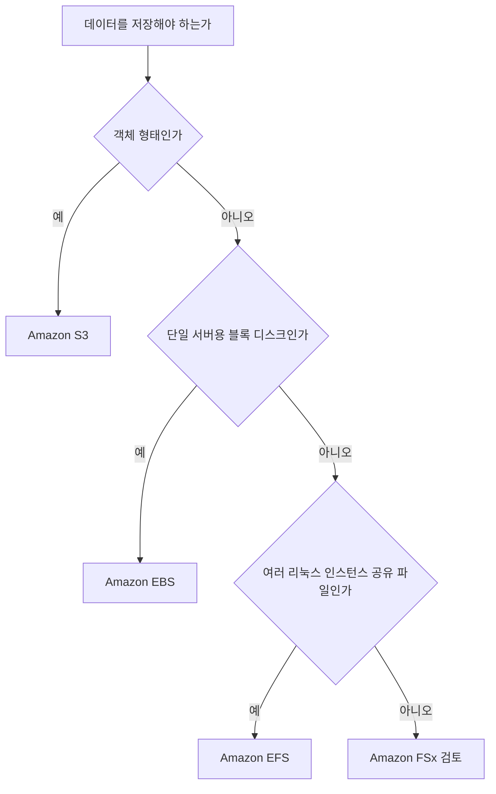

- 객체 저장은 `Amazon S3`
- 인스턴스용 영구 블록 디스크는 `Amazon EBS`
- 공유 파일 시스템은 `Amazon EFS`
- SMB, Lustre, ONTAP 같은 특화 파일 시스템은 `Amazon FSx`

### Database 의사결정

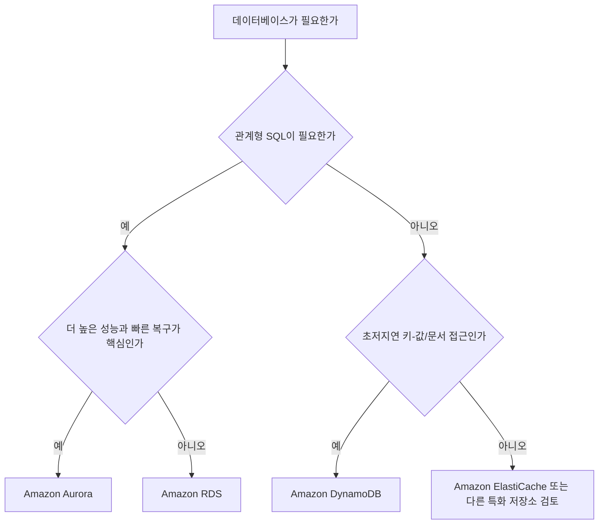

- 일반 SQL 애플리케이션은 `Amazon RDS`
- 더 높은 성능과 읽기 확장, 글로벌 구성이 중요하면 `Amazon Aurora`
- 서버리스 NoSQL과 초저지연이 핵심이면 `Amazon DynamoDB`

### Messaging 의사결정

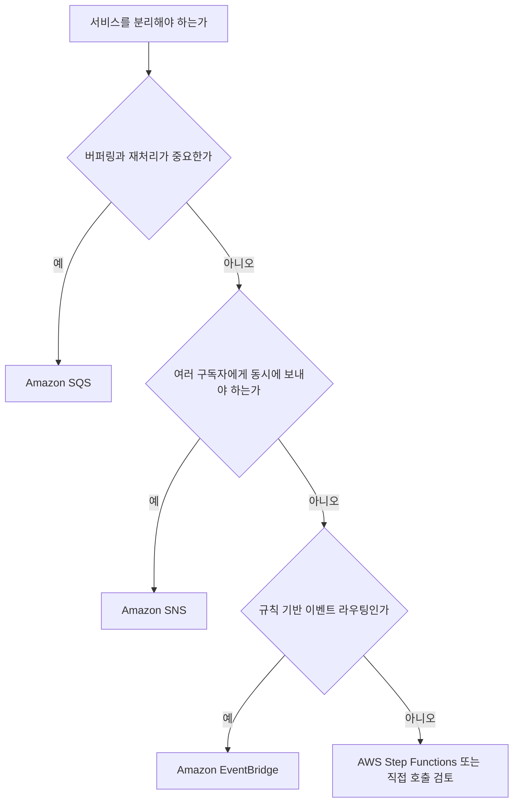

- 비동기 버퍼링은 `Amazon SQS`
- 팬아웃은 `Amazon SNS`
- 규칙 기반 이벤트 버스는 `Amazon EventBridge`
- 상태 기반 절차 제어는 `AWS Step Functions`
